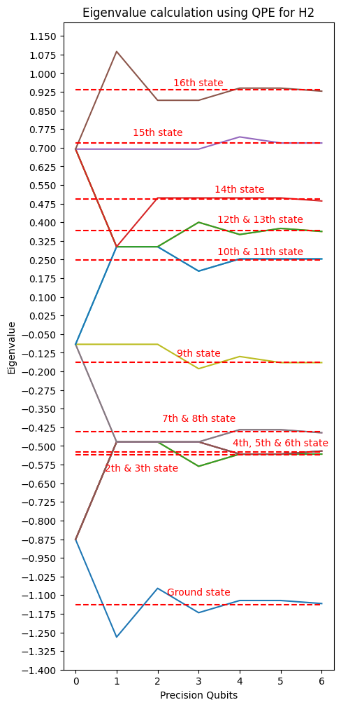

# Quantum Phase Estimation - Code by Kevin J. Joven

This code implementes the quantum phase estimation algorithm for the hydrogen two system $H_2$. This file used some of the codes that are presented in the same repo, as the Pauli decomposition and the trotter formulas.

In short you can see the following plot that shown how the eigenvalues are calculated based on the number of precision qubits (ancilla qubits that increase the precision of the algorithm)!

    

